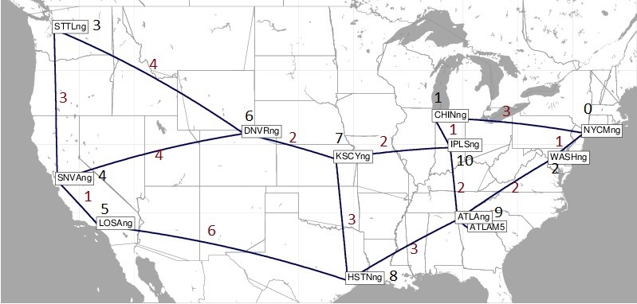

# Substrate network

Network topologies coming from http://sndlib.zib.de/home.action

Network capacities, i.e., CPU and memory of nodes and max. data rate of links, are added within the `read_network` function as specified by the user.

Currently set uniformly inside the `main` function of `main.py`.

## Example: Abilene network

The small Abilene network is a good network to start with. It's a real-world network with just few nodes.

The figure illustrates the network. The black numbers indicate the node IDs and the red numbers the link delays (in ms).